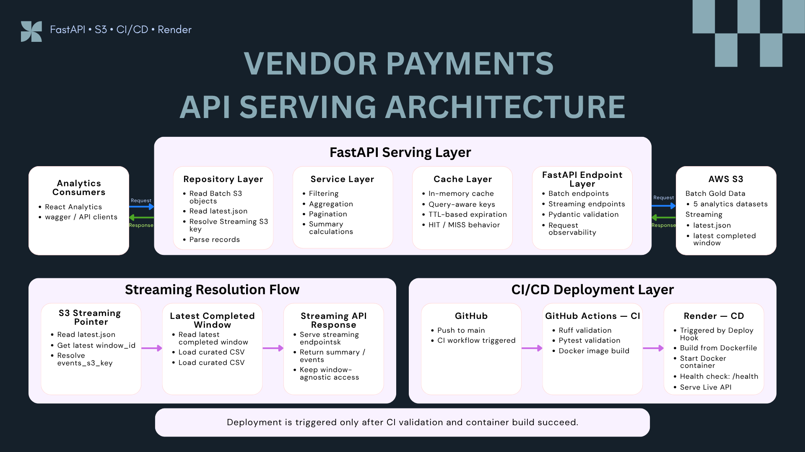
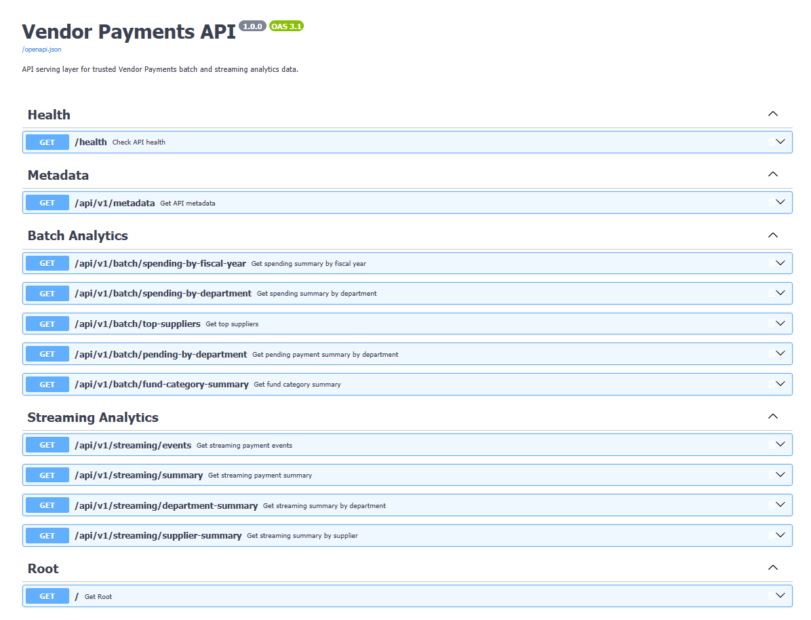
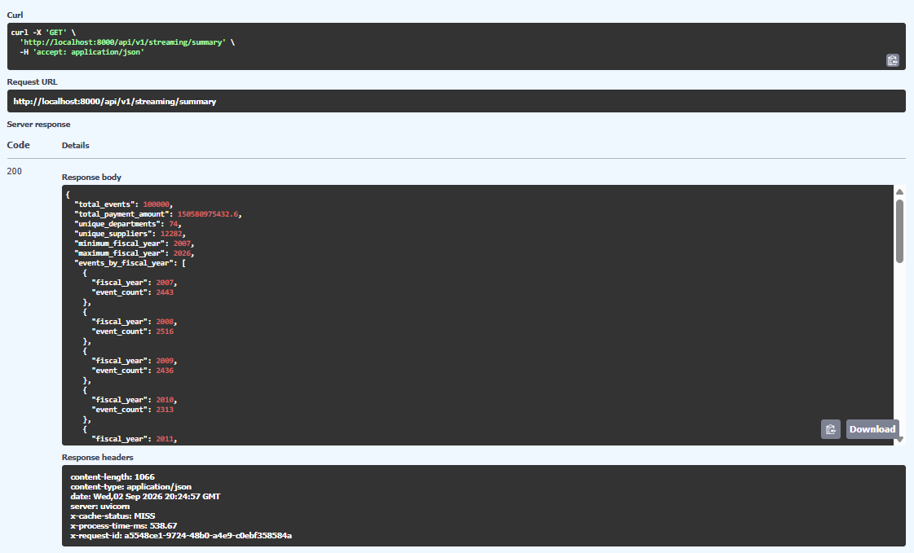
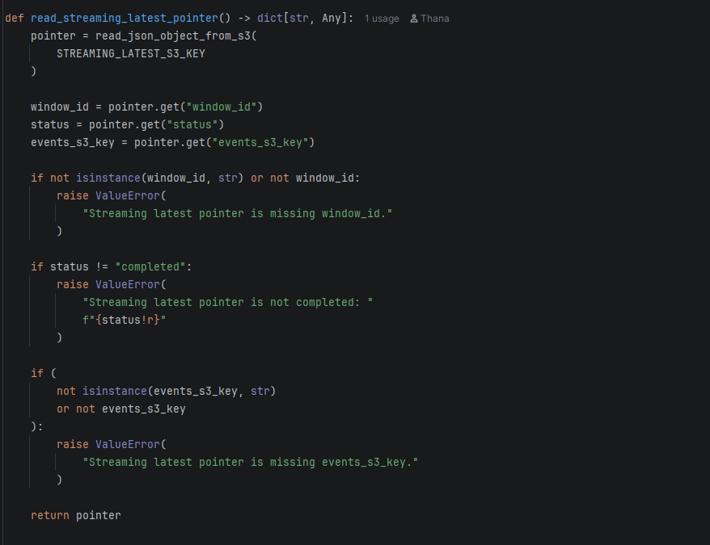
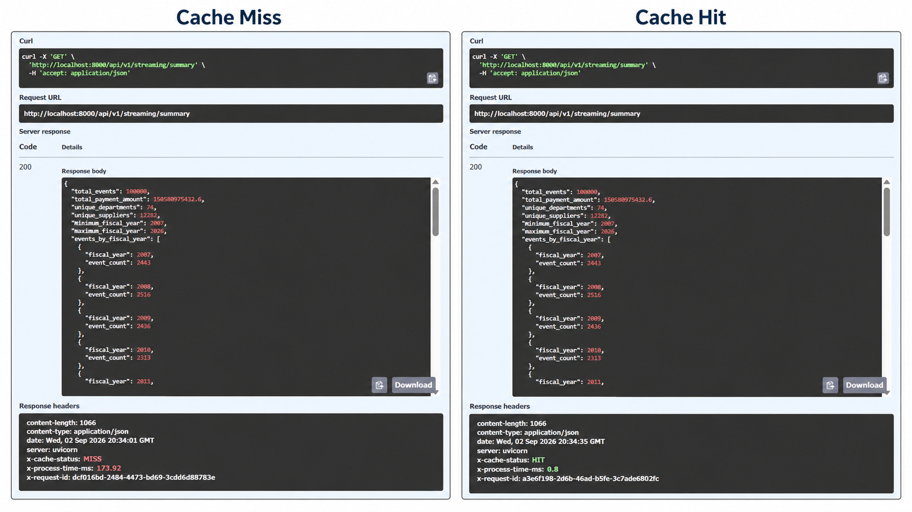
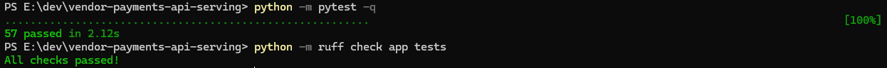
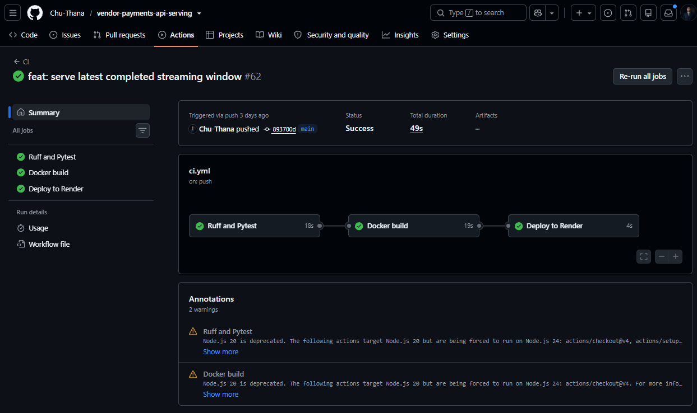
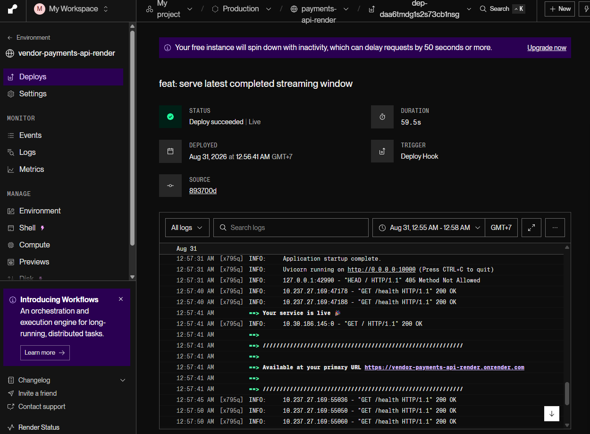

# 🚀 Vendor Payments API Serving


FastAPI serving layer for trusted Vendor Payments Batch and Streaming analytics stored in AWS S3.

The API exposes analytics-ready data through stable REST contracts, resolves the latest completed Streaming window dynamically through `latest.json`, adds request observability and cache-aware response handling, and deploys through a gated GitHub Actions CI/CD pipeline to Render.

**Live API:** https://vendor-payments-api-render.onrender.com  
**Swagger UI:** https://vendor-payments-api-render.onrender.com/docs  
**Analytics Web App:** https://vendor-payments-analytics.vercel.app/

---

## 📌 Project Summary

The API acts as the serving bridge between trusted cloud outputs and downstream consumers such as the React analytics dashboard, Swagger users, and external API clients.

The current API demonstrates:

- S3-backed Batch analytics serving
- Dynamic Streaming window resolution through `latest.json`
- Layered FastAPI architecture
- Batch and Streaming REST endpoints
- Pydantic request and response contracts
- Filtering, aggregation, and pagination
- Request observability middleware
- In-memory cache-aside behavior
- Query-aware cache keys and TTL expiration
- Automated validation with Ruff and Pytest
- Docker build validation
- Gated CI/CD through GitHub Actions and Render Deploy Hooks
- Production health checks through `/health`

The main serving principle is:

```text
Stable API contract
→ dynamic cloud-backed data resolution
→ validated JSON responses
```

---

## 🧭 Architecture



The API architecture is divided into three concerns:

```text
FastAPI Serving Layer
Streaming Resolution Flow
CI/CD Deployment Layer
```

### FastAPI Serving Layer

```text
Analytics Consumers
        ⇅
FastAPI Endpoint Layer
        ⇅
Cache Layer
        ⇅
Service Layer
        ⇅
Repository Layer
        ⇅
AWS S3
```

Request and response traffic is bidirectional:

```text
React / API Client
→ FastAPI
→ S3

S3
→ FastAPI
→ React / API Client
```

### Layer Responsibilities

- **Analytics Consumers** — React Analytics and Swagger / external API clients.
- **FastAPI Endpoint Layer** — Routing, query validation, response schemas, and request observability.
- **Cache Layer** — In-memory cache-aside behavior with query-aware keys and TTL-based expiration.
- **Service Layer** — Filtering, aggregation, pagination, and summary calculations.
- **Repository Layer** — Reads Batch objects, resolves Streaming `latest.json`, loads curated S3 records, and normalizes data.
- **AWS S3** — Stores Batch Gold analytics data and the latest completed Streaming window contract.

---

## 🌊 Streaming Resolution Flow

Streaming serving no longer depends on a hard-coded S3 object.

The API resolves the latest completed Streaming dataset through:

```text
latest.json
→ latest window_id
→ events_s3_key
→ curated Streaming CSV
→ Streaming API response
```

The repository validates three required pointer fields:

```text
window_id
status
events_s3_key
```

The pointer must also satisfy:

```text
status = completed
```

This keeps the API window-agnostic. Downstream consumers do not need to know whether the current dataset is `stream_window_001`, `stream_window_002`, or `stream_window_003`.

---

## ✨ API Surface

The API exposes health, metadata, Batch analytics, and Streaming analytics endpoints.



### Core APIs

```http
GET /
GET /health
GET /api/v1/metadata
```

### Batch Analytics APIs

```http
GET /api/v1/batch/spending-by-fiscal-year
GET /api/v1/batch/spending-by-department
GET /api/v1/batch/top-suppliers
GET /api/v1/batch/pending-by-department
GET /api/v1/batch/fund-category-summary
```

### Streaming Analytics APIs

```http
GET /api/v1/streaming/events
GET /api/v1/streaming/summary
GET /api/v1/streaming/department-summary
GET /api/v1/streaming/supplier-summary
```

Supported behavior includes:

- Fiscal-year filtering
- Department and supplier filtering
- Fund-category filtering
- Deduplication-status filtering
- Combined query filters
- Limit / offset pagination
- Pydantic response models
- Swagger / OpenAPI documentation

---

## 📈 Latest Streaming Summary

The current Streaming Summary endpoint serves the latest completed window resolved through the S3 pointer.

Latest runtime evidence:

```text
HTTP status           = 200
total_events          = 100000
unique_departments    = 74
unique_suppliers      = 12282
minimum_fiscal_year   = 2007
maximum_fiscal_year   = 2026
```



The response also includes request observability and cache headers such as:

```text
X-Request-ID
X-Process-Time-MS
X-Cache-Status
```

---

## 🔗 Latest Streaming Pointer Logic

The repository reads the Streaming pointer from S3 before loading events.

```python
pointer = read_json_object_from_s3(
    STREAMING_LATEST_S3_KEY
)

window_id = pointer.get("window_id")
status = pointer.get("status")
events_s3_key = pointer.get("events_s3_key")
```

The API rejects invalid pointers when:

- `window_id` is missing
- `status != "completed"`
- `events_s3_key` is missing



This removes the previous dependency on fixed Streaming S3 object keys and allows the serving layer to follow the latest completed bounded window.

---

## ⚡ API Response Cache

The API uses an in-memory cache-aside strategy for Batch and Streaming analytics endpoints.

### Cache Behavior

```text
Request
→ Cache lookup

HIT
→ return cached response

MISS
→ call service
→ resolve repository data
→ cache successful result
→ return response
```

The cache uses:

- In-memory Python storage
- Query-aware normalized cache keys
- TTL-based expiration
- `X-Cache-Status: MISS`
- `X-Cache-Status: HIT`

Invalid requests and server errors are not cached.

Latest local Streaming Summary comparison:

```text
Cache MISS
X-Cache-Status: MISS
X-Process-Time-MS: 173.92

Cache HIT
X-Cache-Status: HIT
X-Process-Time-MS: 0.8
```



The repeated request returns the same analytics response while avoiding repeated downstream processing.

---

## 🧠 Request Observability

Every request passes through observability middleware.

The middleware provides:

- Unique request ID generation
- Preservation of client-provided request IDs
- Processing-time measurement
- Structured successful-request logs
- Structured unhandled-error logs

Successful responses expose:

```text
X-Request-ID
X-Process-Time-MS
```

These headers support request tracing and latency inspection during development and troubleshooting.

---

## ✅ Automated Validation

Run:

```powershell
python -m pytest -q
python -m ruff check app tests
```

Current result:

```text
57 passed
All checks passed!
```



Validation covers:

- Root, health, and metadata endpoints
- Batch endpoint responses
- Streaming endpoint responses
- Filtering and combined query filters
- Pagination and invalid pagination
- Request ID behavior
- Processing-time headers
- Structured logging
- Cache storage and retrieval
- TTL expiration
- Normalized cache keys
- Cache MISS followed by HIT
- Separate cache entries for different queries
- Invalid requests not being cached
- Latest Streaming pointer integration

---

## ⚙️ CI/CD Pipeline

GitHub Actions gates production deployment.

```text
Push to main
→ Ruff and Pytest
→ Docker Build
→ Deploy to Render
```

Latest workflow result:

```text
Ruff and Pytest   = PASS
Docker build      = PASS
Deploy to Render  = PASS
Overall status    = Success
```



### Quality Gates

1. **Ruff and Pytest**
   - Validate code quality
   - Run the automated test suite

2. **Docker Build**
   - Runs only after test success
   - Verifies Docker packaging

3. **Deploy to Render**
   - Runs only after Docker build success
   - Runs for validated pushes to `main`
   - Uses a private Render Deploy Hook stored in GitHub Actions secrets

Render Auto-Deploy is disabled so production deployment is controlled by the CI/CD quality gate.

---

## 🚀 Production Deployment

The API is deployed as a Docker-based Render Web Service.

Latest deployment evidence shows:

```text
Status     = Deploy succeeded | Live
Trigger    = Deploy Hook
Health     = GET /health → 200 OK
Service    = Live
```



The production health endpoint returns:

```json
{
  "status": "healthy",
  "service": "vendor-payments-api"
}
```

---

## 🐳 Docker Runtime

The Dockerfile packages the FastAPI service and starts the application with Uvicorn.

```text
Dockerfile
→ install dependencies
→ copy application source
→ start Uvicorn
→ expose FastAPI service
```

Docker build readiness is validated before production deployment.

---

## 🗂️ Project Structure

```text
vendor-payments-api-serving/
│
├── .github/
│   └── workflows/
│       └── ci.yml
│
├── app/
│   ├── api/
│   │   ├── batch.py
│   │   ├── health.py
│   │   ├── metadata.py
│   │   └── streaming.py
│   ├── cache/
│   │   ├── in_memory.py
│   │   └── keys.py
│   ├── middleware/
│   │   └── observability.py
│   ├── models/
│   ├── repositories/
│   │   └── streaming_repository.py
│   ├── services/
│   │   └── streaming_service.py
│   ├── config.py
│   └── main.py
│
├── assets/
│   ├── 00_api_serving_architecture.png
│   ├── 01_swagger_api_endpoints.png
│   ├── 02_streaming_latest_summary.png
│   ├── 03_streaming_latest_pointer_flow.png
│   ├── 04_api_cache_miss_hit.png
│   ├── 05_api_tests_and_lint.png
│   ├── 06_api_ci_cd_success.png
│   └── 07_render_deployment_live.png
│
├── tests/
│   ├── test_batch_endpoints.py
│   ├── test_cache.py
│   ├── test_health.py
│   ├── test_metadata.py
│   ├── test_middleware.py
│   └── test_streaming_endpoints.py
│
├── Dockerfile
├── docker-compose.yml
├── requirements.txt
└── README.md
```

---

## ▶️ Run Locally

Create and activate a virtual environment:

```powershell
python -m venv .venv
.\.venv\Scripts\Activate.ps1
```

Install dependencies:

```powershell
python -m pip install --upgrade pip
python -m pip install -r requirements.txt
```

Run the API:

```powershell
python -m uvicorn app.main:app --reload
```

Open Swagger:

```text
http://127.0.0.1:8000/docs
```

Run tests and Ruff:

```powershell
python -m pytest -q
python -m ruff check app tests
```

---

## 🐳 Run with Docker

Build and start the API:

```powershell
docker compose up --build
```

Open Swagger:

```text
http://localhost:8000/docs
```

Stop containers:

```powershell
docker compose down
```

---

## 🔗 Role in the Vendor Payments Data Platform

```text
Batch ETL
→ Batch Gold in S3
                                 → FastAPI
           /
latest.json
→ latest completed Streaming window
```

Full downstream flow:

```text
Cloud Data Platform
→ Batch Gold
→ Streaming latest.json
→ FastAPI Serving
→ React Analytics
```

The API provides the serving boundary between the trusted cloud datasets and downstream applications.

---

## 🧠 Key Engineering Decisions

### Why use `latest.json` for Streaming?

The API should not hard-code a particular Streaming window or infer the newest object from timestamps.

`latest.json` provides an explicit contract for the latest fully completed window.

### Why validate pointer status?

A pointer is usable only when:

```text
status = completed
```

This prevents the API from serving an incomplete Streaming window.

### Why keep repository and service responsibilities separate?

The repository owns S3 access and record parsing. The service owns filtering, aggregation, pagination, and summary calculations.

This keeps storage logic out of endpoint code.

### Why use in-memory caching?

The current portfolio environment runs a bounded API service where process-local caching is sufficient to demonstrate cache-aside behavior.

A shared Redis cache remains a possible production-scale improvement.

### Why gate Render deployment through GitHub Actions?

Production deployment should occur only after code quality, automated tests, and Docker packaging succeed.

---

## 🛣️ Planned Improvements

Potential production-oriented improvements include:

- Redis-backed shared caching
- Authentication and authorization
- Rate limiting
- Centralized monitoring and observability
- Cache invalidation controls
- More explicit deployment-status verification
- Stronger production configuration and secret management

---

## 🎯 Key Takeaway

The API Serving Layer provides a stable interface over dynamic cloud-backed Batch and Streaming analytics.

```text
Batch Gold
→ S3
→ FastAPI

Streaming
→ latest.json
→ latest completed window
→ FastAPI

FastAPI
→ validation
→ caching
→ observability
→ JSON contracts
→ React / API clients
```

The latest Streaming window can change without requiring downstream consumers or endpoint contracts to change.
