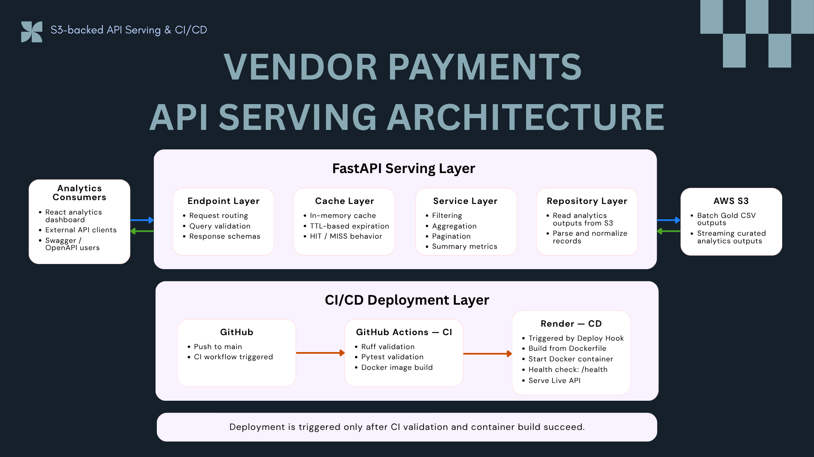
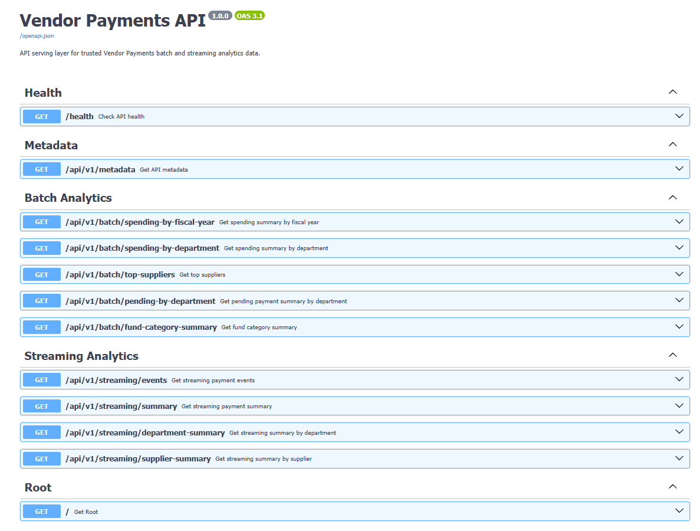
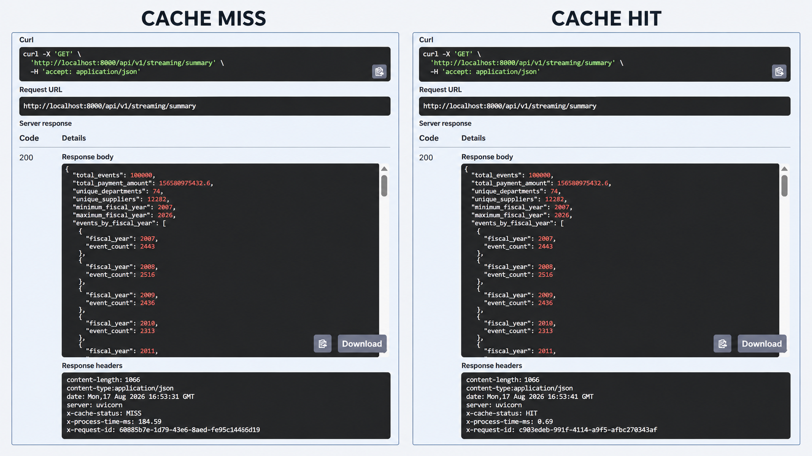
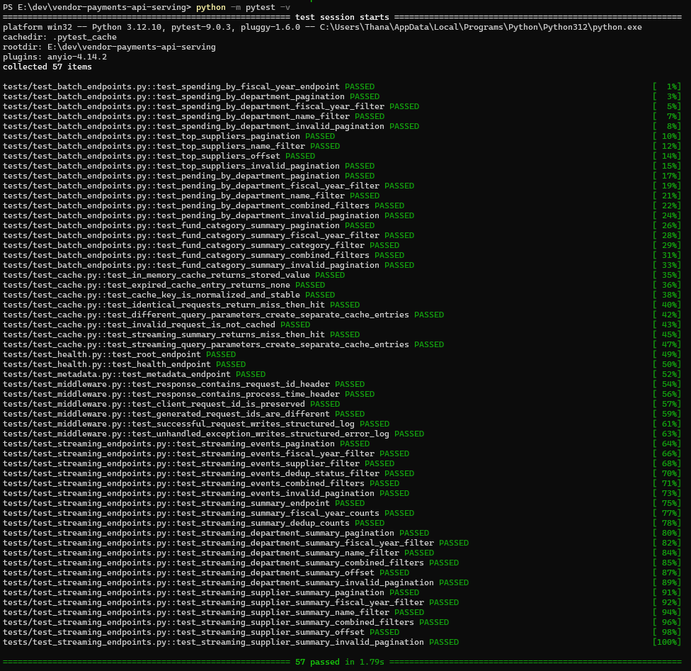
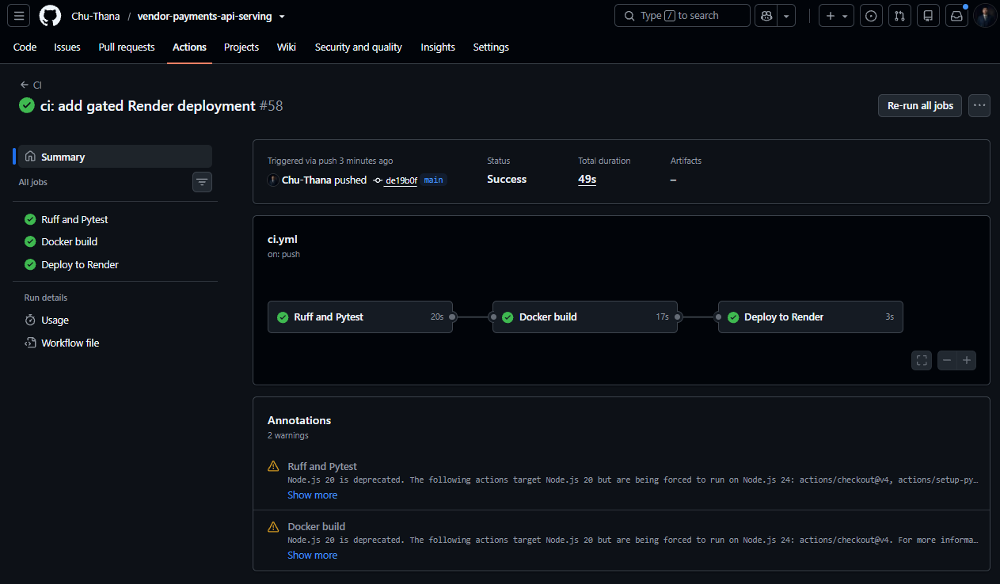
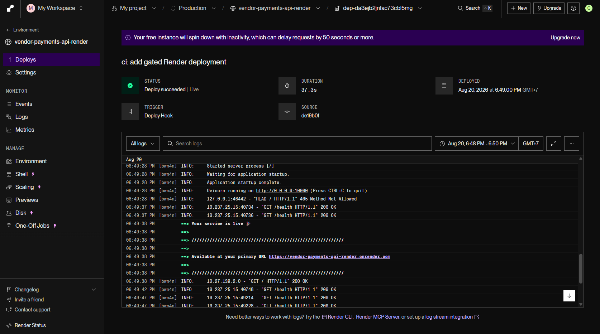

# 🚀 Vendor Payments API Serving


FastAPI serving layer for trusted Vendor Payments batch and streaming analytics data stored in AWS S3.

This project is **Project 2** of the Vendor Payments Data Engineering Portfolio. It exposes analytics-ready Batch and Streaming outputs through validated REST endpoints, adds request observability and cache-aware response handling, and deploys the API to Render through a gated GitHub Actions CI/CD pipeline.

**Live API:** https://vendor-payments-api-render.onrender.com<br>
**Swagger UI:** https://vendor-payments-api-render.onrender.com/docs<br>
**Analytics Web App:** https://vendor-payments-analytics.vercel.app/

---

## 📌 Project Summary

The API acts as the serving bridge between analytics-ready data in AWS S3 and downstream consumers such as the React analytics dashboard and external API clients.

Instead of requiring consumers to read CSV or JSONL artifacts directly, the application provides consistent JSON contracts through FastAPI.

The project demonstrates:

- S3-backed analytics serving
- Layered FastAPI architecture
- Batch and Streaming REST endpoints
- Pydantic request and response contracts
- Query filtering and pagination
- Request observability middleware
- In-memory cache-aside behavior
- Query-aware cache keys and TTL expiration
- Automated validation with Ruff and Pytest
- Docker container validation
- Gated CI/CD with GitHub Actions and Render Deploy Hooks
- Production health checks through `/health`

---

## 🧭 Architecture



The application is organized into two major concerns:

### FastAPI Serving Layer

```text
Analytics Consumers
        ⇅
FastAPI Serving Layer
        ⇅
AWS S3
```

Within the FastAPI application:

Endpoint Layer
→ Cache Layer
→ Service Layer
→ Repository Layer

Analytics consumers send requests to FastAPI and receive validated JSON responses. On a cache MISS, the request continues through the service and repository layers, where the API retrieves trusted Batch and Streaming analytics outputs from AWS S3.

### CI/CD Deployment Layer

```text
Push to main
↓
GitHub Actions
↓
Ruff + Pytest
↓
Docker Build
↓
Render Deploy Hook
↓
Render Deployment
↓
/health
↓
Live API
```

Production deployment is triggered only after CI validation and container build succeed.

### Layer Responsibilities

- **AWS S3** — Stores trusted Batch Gold outputs and curated Streaming analytics outputs.
- **Endpoint Layer** — Handles routing, query validation, response schemas, and HTTP error handling.
- **Cache Layer** — Implements in-memory cache-aside behavior with normalized cache keys and TTL-based expiration.
- **Service Layer** — Applies filtering, aggregation, pagination, sorting, and summary calculations.
- **Repository Layer** — Reads analytics outputs from S3 and parses / normalizes records for the service layer.
- **Analytics Consumers** — React analytics dashboard, external API clients, and Swagger/OpenAPI users.
- **CI/CD Deployment Layer** — Validates code, tests API behavior, verifies Docker build readiness, and gates production deployment to Render.

---

## ✨ API Surface

The API exposes health, metadata, Batch analytics, and Streaming analytics endpoints.



### Core APIs

```http
GET /
GET /health
GET /api/v1/metadata
```

### Batch Analytics APIs

```http
GET /api/v1/batch/spending-by-fiscal-year
GET /api/v1/batch/spending-by-department
GET /api/v1/batch/top-suppliers
GET /api/v1/batch/pending-by-department
GET /api/v1/batch/fund-category-summary
```

### Streaming Analytics APIs

```http
GET /api/v1/streaming/events
GET /api/v1/streaming/summary
GET /api/v1/streaming/department-summary
GET /api/v1/streaming/supplier-summary
```

Supported capabilities include:

- Fiscal year filtering
- Department and supplier filtering
- Fund category filtering
- Deduplication-status filtering
- Combined query filters
- Limit / offset pagination
- Pydantic response models
- Swagger / OpenAPI documentation

---

## ☁️ S3-Backed Data Access

The current API no longer depends on local analytics files for production serving.

Repository functions read trusted analytics outputs from AWS S3 and pass normalized records to the service layer.

```text
AWS S3
  ↓
Repository
  ↓
Service
  ↓
Endpoint
  ↓
Validated JSON Response
```

This keeps storage concerns isolated from API routing and business logic while allowing the React analytics application to consume cloud-backed data through a stable HTTP interface.

---

## 🧠 Middleware Observability

Every request passes through observability middleware before reaching the endpoint layer.

The middleware provides:

- Unique request ID generation
- Preservation of client-provided request IDs
- Processing-time measurement
- Structured completion logs
- Structured unhandled-error logs

Successful responses include:

```text
X-Request-ID
X-Process-Time-MS
```

These headers make it easier to trace individual requests and inspect API latency during development and troubleshooting.

---

## ⚡ API Response Cache

The API uses an **in-memory cache-aside strategy** for Batch and Streaming analytics endpoints.

### Cache Behavior

- Cache backend: In-memory Python cache
- Cache key: Endpoint namespace plus normalized query parameters
- Cache HIT: Return the cached response
- Cache MISS: Call the service, cache the successful result, and return the response
- TTL-based expiration
- Invalid requests are not cached
- Server errors are not cached

Cached responses expose:

```text
X-Cache-Status: MISS
```

or:

```text
X-Cache-Status: HIT
```



Local validation of the Streaming Summary endpoint reduced repeated-request processing time from 184.59 ms on a cache MISS to 0.69 ms on a cache HIT, approximately 268× faster, while returning the same analytics result.

The current cache is process-local and is cleared when the API process restarts. A shared Redis-backed cache remains a possible production-scale improvement.

---

## ✅ Validation

The project is validated locally with Ruff and Pytest.

```powershell
python -m ruff check app tests
python -m pytest -v
```

Current test result:

```text
57 passed
```



Validation covers:

- Root, health, and metadata endpoints
- Batch endpoint responses
- Streaming endpoint responses
- Fiscal-year and name filters
- Combined filters
- Pagination and invalid pagination
- Request ID behavior
- Processing-time headers
- Structured request and error logging
- In-memory cache storage and retrieval
- TTL expiration
- Stable normalized cache keys
- Cache MISS followed by HIT
- Separate cache entries for different query parameters
- Invalid requests not being cached

---

## ⚙️ CI/CD Pipeline

GitHub Actions runs automated checks whenever configured repository events occur.

For production deployment, the pipeline is gated so that deployment to Render happens only after CI succeeds.

```text
Ruff and Pytest
      ↓
Docker Build
      ↓
Deploy to Render
```



### CI Quality Gates

1. **Ruff and Pytest**
   - Checks Python code quality
   - Runs the automated API test suite

2. **Docker Build**
   - Runs only after the test job succeeds
   - Verifies that the application can be packaged from the repository Dockerfile

3. **Deploy to Render**
   - Runs only after the Docker build succeeds
   - Runs only for a `push` to `main`
   - Uses a private Render Deploy Hook stored as a GitHub Actions repository secret

The deploy hook value is not hardcoded in the workflow.

```yaml
env:
  RENDER_DEPLOY_HOOK_URL: ${{ secrets.RENDER_DEPLOY_HOOK_URL }}
```

Render Auto-Deploy is disabled, so production deployment is controlled by the GitHub Actions quality gate instead of starting independently on every commit.

---

## 🚀 Production Deployment

The API is deployed as a Docker-based Render Web Service.

Render:

- Pulls the repository source
- Builds the application from `./Dockerfile`
- Starts the FastAPI service with Uvicorn
- Checks `/health`
- Marks the service live after the deployment succeeds



The deployment evidence shows:

```text
Trigger: Deploy Hook
Status: Deploy succeeded | Live
Health check: GET /health → 200 OK
```

This provides an explicit deployment path from validated source code to a healthy production API.

---

## 🐳 Docker Runtime

The Dockerfile packages the FastAPI application with a slim Python image and starts the API through Uvicorn.

```text
Dockerfile
  ↓
Install Python dependencies
  ↓
Copy application source
  ↓
Start Uvicorn
  ↓
Expose FastAPI service
```

The GitHub Actions pipeline validates Docker build readiness before triggering the Render deployment.

---

## 🗂️ Project Structure

```text
vendor-payments-api-serving/
│
├── .github/
│   └── workflows/
│       └── ci.yml
│
├── app/
│   ├── api/
│   │   ├── batch.py
│   │   ├── health.py
│   │   ├── metadata.py
│   │   └── streaming.py
│   │
│   ├── cache/
│   │   ├── in_memory.py
│   │   └── keys.py
│   │
│   ├── middleware/
│   │   └── observability.py
│   │
│   ├── models/
│   ├── repositories/
│   ├── services/
│   ├── config.py
│   └── main.py
│
├── assets/
│   └── vendor-payments-api/
│       ├── architecture/
│       │   └── 00_api-serving-architecture.png
│       └── evidence/
│           ├── 01_swagger-api-endpoints.png
│           ├── 02_cache-miss-hit.png
│           ├── 03_api-local-validation-57-tests.png
│           ├── 04_ci-cd-pipeline-passed.png
│           └── 05_render-deploy-hook-live.png
│
├── tests/
│   ├── test_batch_endpoints.py
│   ├── test_cache.py
│   ├── test_health.py
│   ├── test_metadata.py
│   ├── test_middleware.py
│   └── test_streaming_endpoints.py
│
├── Dockerfile
├── docker-compose.yml
├── requirements.txt
└── README.md
```

---

## ▶️ Run Locally

Create and activate a virtual environment:

```powershell
python -m venv .venv
.\.venv\Scripts\Activate.ps1
```

Install dependencies:

```powershell
python -m pip install --upgrade pip
python -m pip install -r requirements.txt
```

Run the API:

```powershell
python -m uvicorn app.main:app --reload
```

Open Swagger:

```text
http://127.0.0.1:8000/docs
```

---

## 🐳 Run with Docker

Build and start the API:

```powershell
docker compose up --build
```

Open Swagger:

```text
http://localhost:8000/docs
```

Stop the containers:

```powershell
docker compose down
```

---

## 🔗 Role in the Vendor Payments Data Platform

```text
Project 1 — Batch ETL Pipeline
Project 2 — API Serving Layer
Project 3 — Kafka Streaming Pipeline
Project 4 — Airflow Orchestration
Project 5 — Cloud Data Platform
```

Project 2 converts trusted Batch and Streaming analytics outputs in AWS S3 into consistent, validated, observable, cache-aware JSON responses for downstream applications.

It provides the serving boundary between the data platform and the React analytics layer.

---

## 🛣️ Planned Improvements

Potential future improvements include:

- Redis-backed shared caching
- Cache invalidation and administration controls
- Authentication and authorization
- Rate limiting
- Centralized monitoring and observability
- More explicit deployment-status verification from CI/CD
- Dynamic handling of rotated Streaming S3 object keys

---

## 🎯 Key Takeaway

This project is more than a collection of API endpoints.

It demonstrates how a layered serving application can expose trusted cloud-backed analytics data through validated REST contracts, request observability, cache-aware response handling, automated testing, Docker validation, and gated CI/CD deployment.

The resulting API provides a stable interface between the Vendor Payments data platform and downstream analytics applications.
